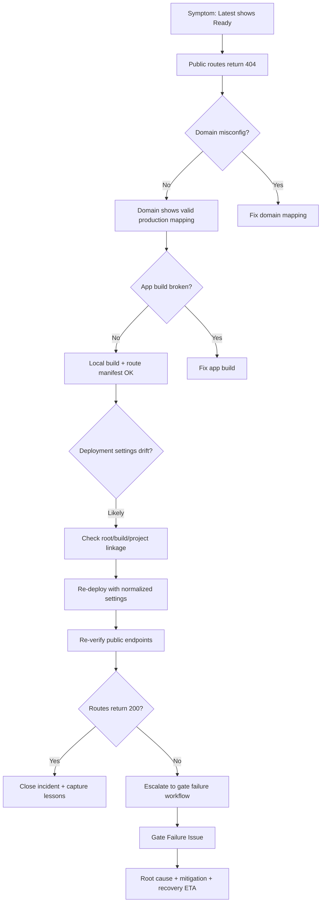

# 404 Investigation Flow (Mermaid)

## Control insight
- A deployment status label is not sufficient evidence of serving correctness.
- Release gate must require endpoint-level verification artifacts.
